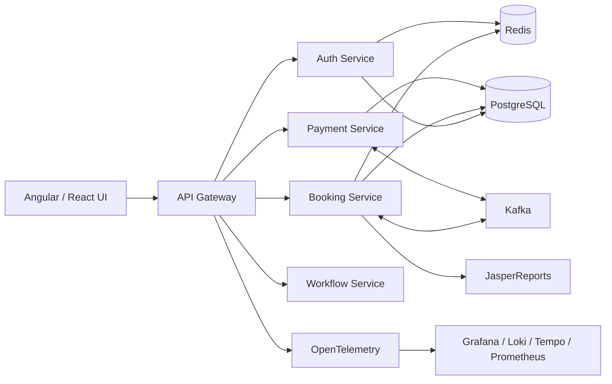

  

<h1 align="center">PHAT DO</h1>
<h3 align="center">Fullstack Developer | Java • Spring Boot • Angular • React</h3>

  Building scalable, secure, and observable fullstack systems.

  

---

## About Me

I am a fullstack developer focused on building modern web applications with Java, Spring Boot, Angular, and React. I care about clean API design, secure authentication, event-driven systems, reporting, and observability.

- Building fullstack systems from UI to backend services.
- Designing REST APIs, authentication flows, and service boundaries.
- Working with relational databases, cache, messaging, reports, and monitoring.
- Improving architecture with Docker, Kafka, Redis, OpenTelemetry, and clean code practices.

## Tech Stack

| Area | Technologies |
| --- | --- |
| Backend | Java, Spring Boot, Spring Security, REST API |
| Frontend | Angular, React, JavaScript, TypeScript, HTML5, CSS3/SCSS |
| Database | PostgreSQL, SQL Server, Redis |
| Messaging | Kafka |
| DevOps / Observability | Docker, Git, GitHub, OpenTelemetry |
| Tools | IntelliJ IDEA, Visual Studio, VS Code, Postman |

  

  
  

## Featured Projects

### 01. Booking System

Fullstack hotel reservation system built with a production-style microservice architecture.

- Angular customer/admin/host UI.
- Java Spring Boot services behind an API Gateway.
- Keycloak authentication, JWT, role-based access, and optional 2FA.
- PostgreSQL data layer, Redis cache, Kafka events, and Docker Compose.
- JasperReports for booking, revenue, receipt, and export flows.
- Observability with OpenTelemetry, Grafana, Prometheus, Loki, Promtail, and Tempo.

**Stack:** Angular, TypeScript, Java, Spring Boot, PostgreSQL, Kafka, Redis, Docker, OpenTelemetry

[View Repository](https://github.com/DoTruongPhat/Booking-System)

### 02. Payment / Reporting System

Payment and reporting module focused on reliable payment state, async processing, and operational visibility.

- Payment initialization, callback handling, cancellation, manual sync, and refund flow.
- Kafka-based async payment/report events.
- JasperReports templates for revenue and booking exports.
- Service logs, metrics, tracing, and dashboard-ready observability.

**Stack:** Java, Spring Boot, PostgreSQL, Kafka, JasperReports, OpenTelemetry

[View Payment Service](https://github.com/DoTruongPhat/Booking-System/tree/main/payment-service) ·
[View Reporting Flow](https://github.com/DoTruongPhat/Booking-System/tree/main/booking-service)

## System Architecture

## GitHub Stats

  
  

  

## Current Focus

- Fullstack architecture with Java, Spring Boot, Angular, and React.
- Secure authentication and authorization flows.
- Event-driven backend systems with Kafka and Redis.
- Observability, tracing, logs, metrics, and operational dashboards.
- Clean API design and maintainable service boundaries.

## Contact

  
  

