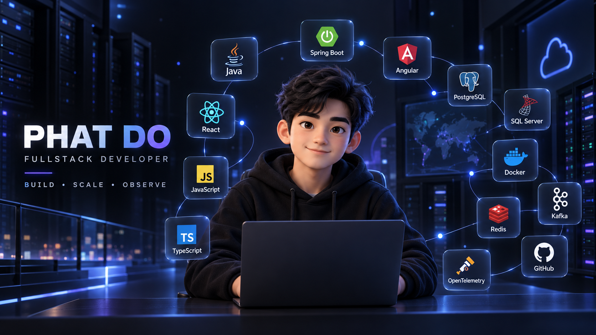

<p align="center">
  <a href="./assets/profile/hero.webm">
    
  </a>
  <br />
  <sub>Click the banner to watch the hero video.</sub>
</p>

<h1 align="center">PHAT DO</h1>
<h3 align="center">Fullstack Developer | Java • Spring Boot • Angular • React</h3>

<p align="center">
  Building scalable, secure, and observable fullstack systems.
</p>

<p align="center">
  <a href="https://github.com/DoTruongPhat?tab=repositories">GitHub: DoTruongPhat</a>
</p>

---

## About Me

I am a fullstack developer focused on building modern web applications with Java, Spring Boot, Angular, and React. I care about clean API design, secure authentication, event-driven systems, reporting, and observability.

- Building fullstack systems from UI to backend services.
- Designing REST APIs, authentication flows, and service boundaries.
- Working with relational databases, cache, messaging, reports, and monitoring.
- Improving architecture with Docker, Kafka, Redis, OpenTelemetry, and clean code practices.

## Tech Stack

| Group | Technologies |
| --- | --- |
| Backend | Java, Spring Boot, Spring Security, REST API |
| Frontend | Angular, React, TypeScript, JavaScript, HTML5, CSS3/SCSS |
| Database | PostgreSQL, SQL Server, Redis |
| Messaging | Kafka |
| DevOps / Observability | Docker, OpenTelemetry, Git, GitHub |
| Tools | IntelliJ IDEA, Visual Studio / VS Code |

<p align="center">
  
</p>

<p align="center">
  
  
</p>

## Featured Projects

### 01. Booking System

Fullstack hotel reservation system built with a production-style microservice architecture.

- Angular customer/admin/host UI.
- Java Spring Boot services behind an API Gateway.
- Keycloak authentication, JWT, role-based access, and optional 2FA.
- PostgreSQL and SQL Server data layer, Redis cache, Kafka events, and Docker Compose.
- JasperReports for booking, revenue, receipt, and export flows.
- Observability with OpenTelemetry, Grafana, Prometheus, Loki, Promtail, and Tempo.

**Stack:** Angular, TypeScript, Java, Spring Boot, PostgreSQL, SQL Server, Kafka, Redis, Docker, OpenTelemetry

[View Repository](https://github.com/DoTruongPhat/Booking-System)

### 02. GlassStore

Fullstack eyewear e-commerce system for product browsing, custom glasses design, cart, order workflow, and staff operations.

- React customer interface with routing, cart, checkout, custom glasses design, and eye profile flows.
- Spring Boot REST API with Spring Security and JWT authentication.
- SQL Server database with JPA/Hibernate persistence.
- Product, frame, lens, ready-made glasses, discount, order, review, return, and notification modules.
- Staff/admin operations for product management, manufacturing orders, shipments, and user management.

**Stack:** React, JavaScript, Java 21, Spring Boot 3, Spring Security, JWT, SQL Server, Docker

[View Repository](https://github.com/DoTruongPhat/GlassWeb)

## System Architecture

```text
Angular / React UI
        |
        v
API Gateway
        |
        +--> Auth Service -----> PostgreSQL / SQL Server
        +--> Booking Service --> PostgreSQL / SQL Server
        +--> Payment Service --> PostgreSQL / SQL Server
        +--> Workflow Service

Booking Service <--> Kafka <--> Payment Service
Booking/Auth    <--> Redis
Booking Service ---> JasperReports
Services        ---> OpenTelemetry ---> Grafana / Loki / Tempo / Prometheus
```

## GitHub Stats

- Main profile: [DoTruongPhat](https://github.com/DoTruongPhat)
- Featured repository: [Booking-System](https://github.com/DoTruongPhat/Booking-System)
- Focus languages: Java, TypeScript, JavaScript, SQL

## Current Focus

- Fullstack architecture with Java, Spring Boot, Angular, and React.
- Secure authentication and authorization flows.
- Event-driven backend systems with Kafka and Redis.
- Observability, tracing, logs, metrics, and operational dashboards.
- Clean API design and maintainable service boundaries.

## Contact

- Email: [dotruongphat9@gmail.com](mailto:dotruongphat9@gmail.com)
- GitHub: [github.com/DoTruongPhat](https://github.com/DoTruongPhat)
